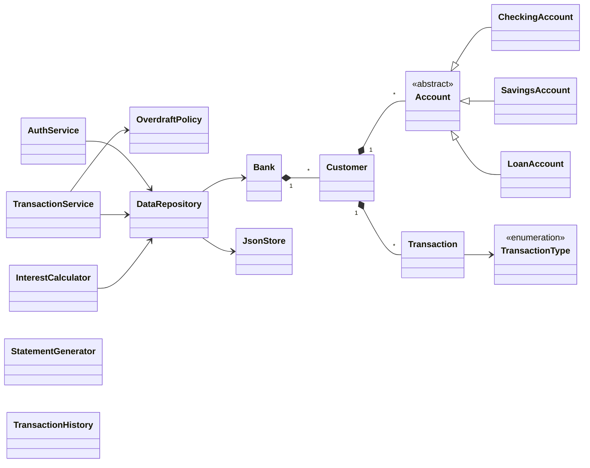

# JJRAM Banking System

A terminal-only Java banking simulator built as a UMBC team final project.

A customer logs in with an ID and PIN, manages three account types
(**Checking**, **Savings**, **Loan**), moves money between them, sees a
printed statement and a filtered transaction history — and **all state
persists to a single JSON file between runs**. An "end of month" admin
action applies interest to savings and loan accounts.

> **Quick links** &nbsp;
> [API Reference (JavaDoc)](docs/javadoc/index.html) &middot;
> [Class Diagram](UML_Diagrams/class_diagram.md) &middot;
> [Sequence Diagrams](UML_Diagrams/) &middot;
> [Per-Person Guides](#per-person-guides)

---

## 🔑 Default login

The program **does not have a "register" menu** — there's no UI for a user
to create their own account. Instead, the first time it runs (when
`bank.json` is empty) it auto-seeds a single fixed demo customer so the
program is usable straight out of the box:

| Customer ID | PIN    | Name     | Accounts                                            |
|-------------|--------|----------|-----------------------------------------------------|
| **`1001`**  | **`1234`** | Jane Doe | `CHK-1001` $500.00 · `SAV-1001` $2,000.00 · `LN-1001` -$5,000.00 |

> Three wrong PINs in a row lock the account. To unlock, delete
> `data/bank.json` and re-run (which re-seeds), or call
> `AuthService.unlock("1001")` from code.

To add more customers, either edit `data/bank.json` directly or extend the
menu with a register-account option that calls
`DataRepository.addCustomer(...)`.

---

## Table of contents

1. [What it does](#what-it-does)
2. [Demo at a glance](#demo-at-a-glance)
3. [Tech stack](#tech-stack)
4. [Project layout](#project-layout)
5. [How to run](#how-to-run)
6. [How to generate the JavaDoc](#how-to-generate-the-javadoc)
7. [UML Diagrams](#uml-diagrams)
8. [The team](#the-team)
9. [Per-person guides](#per-person-guides)
10. [Definition of done](#definition-of-done)

---

## What it does

A command-line program that lets a customer:

1. **Log in** with a Customer ID + PIN (3 wrong PINs locks the account).
2. **View** their accounts (Checking, Savings, Loan).
3. **Deposit, withdraw, and transfer** money between accounts.
4. **Print a statement** and search a **full transaction history**.
5. **Persist everything** to `data/bank.json` so the state survives restarts.

The bank also runs an "end of month" admin action that:
- Applies interest to savings accounts (rate / 12 per month).
- Charges interest on loan balances.
- Records both as `INTEREST` transactions.
- Charges an overdraft fee on checking accounts that dip below zero
  (handled inside `TransactionService` via `OverdraftPolicy`).

---

## Demo at a glance

```text
=================================================
        JJRAM Banking System — v1.0
=================================================
Customer ID: 1001
PIN: 1234
Welcome, Jane Doe!

--- Jane Doe ---
  1) View accounts
  2) Deposit
  3) Withdraw
  4) Transfer
  5) Print statement (last 30 days)
  6) Transaction history
  7) [Admin] Apply monthly interest
  0) Quit
>
```

A demo customer `1001` (PIN `1234`) is seeded automatically on first run if
the bank is empty — so the program is usable straight out of the box.

---

## Tech stack

| Tool        | Version | Why                                  |
|-------------|---------|--------------------------------------|
| **Java**    | 17+     | Source/target level                  |
| **Maven**   | 3.x     | Build, dependencies, javadoc plugin  |
| **Gson**    | 2.10.1  | JSON read/write                      |
| **JUnit**   | 5.10.2  | Tests                                |

If you don't have Maven, the project also works with plain `javac` —
see [How to run](#how-to-run).

---

## Project layout

```
JJRAM_Final_Project/
├── pom.xml                          Maven build + javadoc plugin
├── README.md                        (this file)
├── ABDUL_RAHMAN_FORNAH_GUIDE.md     Per-person brief
├── MAX_PRIBAC_GUIDE.md              Per-person brief
├── JOHN_GUIDE.md                    Per-person brief
├── javadoc-overrides.css            Custom JavaDoc theme
├── javadoc-overview.html            JavaDoc landing page
├── data/
│   └── bank.json                    Created at runtime
├── docs/javadoc/                    Generated API reference (open index.html)
├── UML_Diagrams/                    Class + sequence + package diagrams
└── src/main/java/bank/
    ├── Main.java                     (Abdul, debugger: Ramya)
    ├── model/
    │   ├── Bank.java                 (John)
    │   ├── Customer.java             (Abdul)
    │   ├── Account.java              (Abdul)
    │   ├── CheckingAccount.java      (Abdul, helped by Jordon)
    │   ├── SavingsAccount.java       (Abdul)
    │   ├── LoanAccount.java          (Abdul)
    │   ├── Transaction.java          (Max)
    │   └── TransactionType.java      (Max)
    ├── auth/
    │   └── AuthService.java          (Abdul, helped by Jordon)
    ├── service/
    │   ├── TransactionService.java   (Max)
    │   ├── InterestCalculator.java   (Max)
    │   └── OverdraftPolicy.java      (Max, tested by Ramya)
    ├── reporting/
    │   ├── StatementGenerator.java   (John)
    │   └── TransactionHistory.java   (John)
    └── persistence/
        ├── JsonStore.java            (John)
        └── DataRepository.java       (John)
```

### How the pieces talk to each other

```
        Main (menu loop)
           |
           v
      AuthService  --->  loads Customer via DataRepository
           |
           v
   TransactionService  --->  reads/writes Account balances
           |                      records Transaction objects
           v
   DataRepository  --->  JsonStore  --->  bank.json
           |
           v
   StatementGenerator / TransactionHistory  --->  prints to terminal
```

**Golden rule:** nobody talks to `bank.json` directly except `JsonStore`.
Everyone else goes through `DataRepository`.

---

## How to run

### With Maven (recommended)

```bash
mvn compile
mvn exec:java -Dexec.mainClass="bank.Main"
```

### Without Maven (plain javac)

Download `gson-2.10.1.jar` from
[Maven Central](https://repo1.maven.org/maven2/com/google/code/gson/gson/2.10.1/gson-2.10.1.jar)
into `lib/`, then:

```bash
# Windows PowerShell
javac --release 17 -d target\classes -cp lib\gson-2.10.1.jar `
    (Get-ChildItem -Recurse src\main\java -Filter *.java).FullName

java -cp "target\classes;lib\gson-2.10.1.jar" bank.Main
```

```bash
# macOS / Linux
javac --release 17 -d target/classes -cp lib/gson-2.10.1.jar \
    $(find src/main/java -name '*.java')

java -cp "target/classes:lib/gson-2.10.1.jar" bank.Main
```

### In your IDE

Right-click `Main.java` → **Run** (IntelliJ / VS Code / Eclipse).

---

## How to generate the JavaDoc

A pre-generated copy lives in [docs/javadoc/](docs/javadoc/) — just open
[`docs/javadoc/index.html`](docs/javadoc/index.html) in any browser.

To regenerate from source:

```bash
mvn javadoc:javadoc
# output: docs/javadoc/index.html
```

The build pulls in the custom theme from
[`javadoc-overrides.css`](javadoc-overrides.css) and the landing-page copy
from [`javadoc-overview.html`](javadoc-overview.html), so the docs come out
styled and ready to read.

---

## UML Diagrams

Diagrams live in the [UML_Diagrams/](UML_Diagrams/) folder. Each diagram is
provided as **PNG**, **SVG**, **PlantUML source**, and **Mermaid source** —
download / copy whichever fits your slide deck or report.

### Class diagram (full)


Downloads:
[PNG](UML_Diagrams/images/class_diagram.png) ·
[SVG](UML_Diagrams/images/class_diagram.svg) ·
[PlantUML source](UML_Diagrams/class_diagram.puml) ·
[Mermaid source](UML_Diagrams/class_diagram.md)

A compact Mermaid version (renders inline on GitHub):



### Sequence: Login


Downloads:
[PNG](UML_Diagrams/images/sequence_login.png) ·
[SVG](UML_Diagrams/images/sequence_login.svg) ·
[PlantUML](UML_Diagrams/sequence_login.puml) ·
[Mermaid](UML_Diagrams/sequence_login.md)

### Sequence: Transfer (with rollback)


Downloads:
[PNG](UML_Diagrams/images/sequence_transfer.png) ·
[SVG](UML_Diagrams/images/sequence_transfer.svg) ·
[PlantUML](UML_Diagrams/sequence_transfer.puml) ·
[Mermaid](UML_Diagrams/sequence_transfer.md)

### Package dependencies


Downloads:
[PNG](UML_Diagrams/images/package_diagram.png) ·
[SVG](UML_Diagrams/images/package_diagram.svg) ·
[PlantUML](UML_Diagrams/package_diagram.puml) ·
[Mermaid](UML_Diagrams/package_diagram.md)

---

## The team

| Role                          | Name                  | Email                    |
|-------------------------------|-----------------------|--------------------------|
| Lead, models, auth, wiring    | **Abdul Rahman Fornah** | `afornah1@umbc.edu`     |
| Transactions, overdraft, interest | **Max Pribac**     | `mpribac@umbc.edu`       |
| Statements, history, JSON     | **John**              | `smartdude879@gmail.com` |
| Reviewer / helper (auth track)| **Jordon Tang**       | `jtang10@umbc.edu`       |
| Debugger / QA                 | **Ramya Bommakanti**  | `ramyab1@umbc.edu`       |

### What everyone did

- **Abdul Rahman Fornah** — Built the model layer
  (`Customer`, `Account`, the three account subclasses) plus the
  `AuthService` (login + 3-strike lockout + admin unlock). Wired the whole
  thing together inside `Main.java` and set up the demo seed data.

- **Max Pribac** — Owns every code path where money moves.
  `TransactionService.deposit/withdraw/transfer` (with atomic rollback on
  failed transfers), `OverdraftPolicy` (the rules around dipping below
  zero), and `InterestCalculator` (the monthly interest job that walks
  every account). `Transaction` + `TransactionType` are also his.

- **John** — Owns the "memory" of the bank. `JsonStore` is the only class
  that touches `bank.json` (with atomic writes, corruption recovery, and
  custom Gson adapters for `BigDecimal` / `LocalDateTime` /
  polymorphic `Account`). `DataRepository` is the single front door for
  everyone else. `StatementGenerator` and `TransactionHistory` produce the
  pretty terminal output.

- **Jordon Tang** — Reviewed and helped iterate on the authentication
  flow (specifically `CheckingAccount` overdraft logic and `AuthService`
  lockout semantics).

- **Ramya Bommakanti** — Debugged the menu loop in `Main.java` and the
  overdraft fee edge cases in `OverdraftPolicy`.

---

## Per-person guides

Each teammate has a deeper brief explaining exactly what they own and
why:

- [ABDUL_RAHMAN_FORNAH_GUIDE.md](ABDUL_RAHMAN_FORNAH_GUIDE.md) — models, accounts, login
- [MAX_PRIBAC_GUIDE.md](MAX_PRIBAC_GUIDE.md) — transactions, overdraft, interest
- [JOHN_GUIDE.md](JOHN_GUIDE.md) — statements, history, JSON persistence

---

## Definition of done

- [x] Program runs from `mvn exec:java` with no errors
- [x] All three account types work (Checking, Savings, Loan)
- [x] Login + PIN auth with 3-strike lockout
- [x] Deposit, withdraw, transfer update both balances and the JSON file
- [x] Overdraft handled by policy (blocked beyond limit, fee on dip)
- [x] Interest can be applied to savings and loans
- [x] Statement prints cleanly with opening balance / activity / closing
- [x] Transaction history can be filtered by date range, type, amount, keyword
- [x] First run: empty `bank.json` is handled gracefully (seeds a demo customer)
- [x] Corrupted JSON is backed up rather than overwritten
- [x] JavaDoc generated to `docs/javadoc/`
- [x] UML diagrams committed under `UML_Diagrams/`
