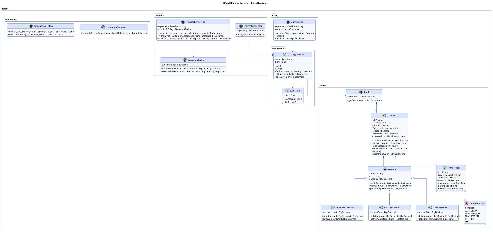
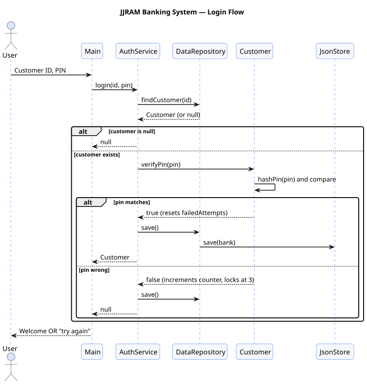
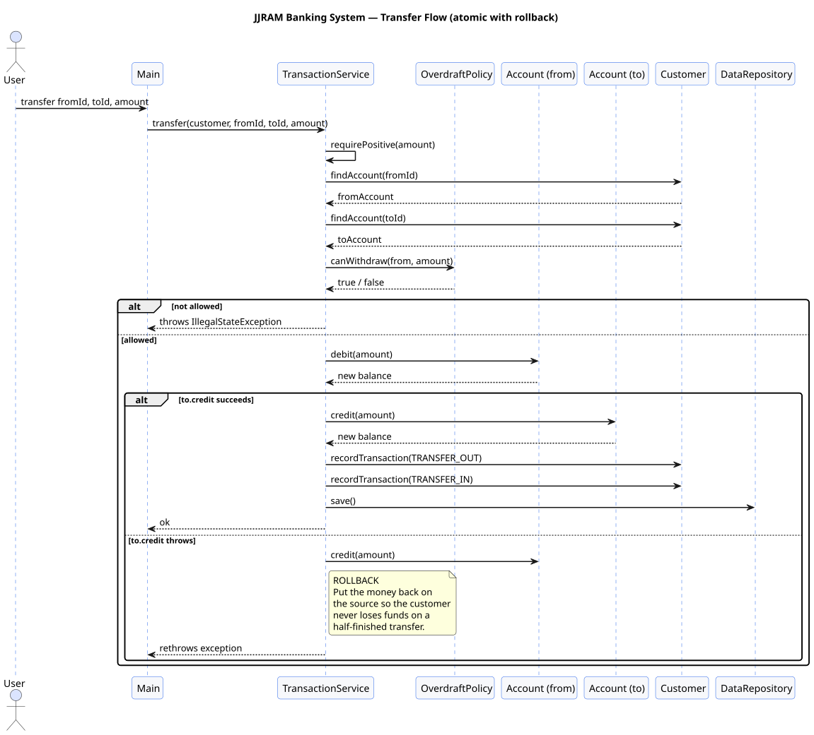
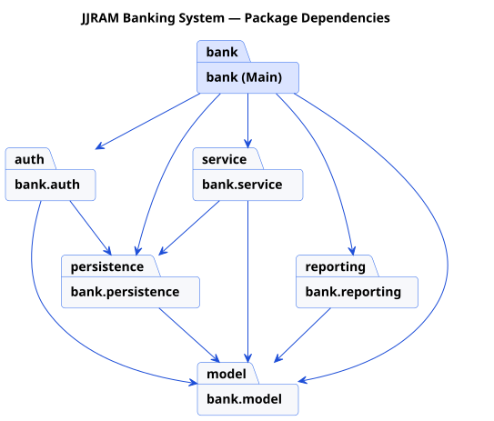

# UML Diagrams

Every diagram in this folder is provided in **four formats** so you can view
it anywhere and copy it into a slide deck / paper / report without trouble:

| Format          | What it's for                                                           |
|-----------------|-------------------------------------------------------------------------|
| `images/*.png`  | Open in any image viewer · drop into PowerPoint / Word / Google Docs    |
| `images/*.svg`  | Open in any browser · scales to any size without blur · best for print  |
| `*.md`          | Mermaid source — renders natively on GitHub                             |
| `*.puml`        | PlantUML source — open with the IntelliJ / VS Code PlantUML plugin      |

> **To download:** right-click any file under `images/` → *Save link as*…
> (or open `UML_Diagrams/images/` in your file manager and copy the file).

---

## 1. Class diagram — full system

The full set of classes, fields, methods, inheritance and "has-a" relationships.



Sources: [`class_diagram.svg`](images/class_diagram.svg) ·
[`class_diagram.png`](images/class_diagram.png) ·
[`class_diagram.puml`](class_diagram.puml) ·
[`class_diagram.md`](class_diagram.md) (Mermaid)

---

## 2. Sequence diagram — Login flow

What happens when a user types Customer ID + PIN.



Sources: [`sequence_login.svg`](images/sequence_login.svg) ·
[`sequence_login.png`](images/sequence_login.png) ·
[`sequence_login.puml`](sequence_login.puml) ·
[`sequence_login.md`](sequence_login.md) (Mermaid)

Highlights:

- PINs are stored as SHA-256 hex hashes — plaintext never touches disk.
- Three wrong PINs in a row sets `locked = true`. Only an admin call to
  `auth.unlock(id)` clears the flag.
- Every state change (failed attempt, lock, successful login) gets persisted
  immediately — closing the program mid-attempt doesn't reset the counter.

---

## 3. Sequence diagram — Transfer flow (with rollback)

The most interesting flow in the system. If the destination account rejects
the credit, the source's debit is reversed before the exception propagates.



Sources: [`sequence_transfer.svg`](images/sequence_transfer.svg) ·
[`sequence_transfer.png`](images/sequence_transfer.png) ·
[`sequence_transfer.puml`](sequence_transfer.puml) ·
[`sequence_transfer.md`](sequence_transfer.md) (Mermaid)

> **The golden rule:** either the whole transfer succeeds, or *nothing*
> changed. The customer never loses money on a half-finished transfer.

---

## 4. Package diagram — Dependency layers

How the packages depend on each other. Arrows point from **uses** → **used by**.



Sources: [`package_diagram.svg`](images/package_diagram.svg) ·
[`package_diagram.png`](images/package_diagram.png) ·
[`package_diagram.puml`](package_diagram.puml) ·
[`package_diagram.md`](package_diagram.md) (Mermaid)

**Why the arrows go this way:**

- **`model`** depends on nothing — pure data + behaviour. Easy to test,
  easy to serialise, easy to reuse.
- **`persistence`** depends only on `model`. It knows *what* to save but
  doesn't know who's calling it or why.
- **`service`** and **`reporting`** depend on `model` + `persistence`. They
  do the actual work; they don't know about the UI.
- **`Main`** (in package `bank`) depends on everything — it's the wiring
  layer, the only place that knows how to assemble the whole app.

This is the standard "onion" layout: outer layers know about inner layers,
never the other way round.

---

## How to regenerate the images

If you edit a `.puml` file you can re-render with PlantUML.

```bash
# Requires Java (any 17+ JDK works). plantuml.jar lives in lib/ after the
# first build. If not, grab it from https://plantuml.com/download .

java -jar lib/plantuml.jar -tsvg -o images UML_Diagrams/*.puml
java -jar lib/plantuml.jar -tpng -o images UML_Diagrams/*.puml
```

PlantUML uses Graphviz (`dot`) under the hood for class & package diagram
layout. Check that it's bundled / installed with:

```bash
java -jar lib/plantuml.jar -testdot
```
