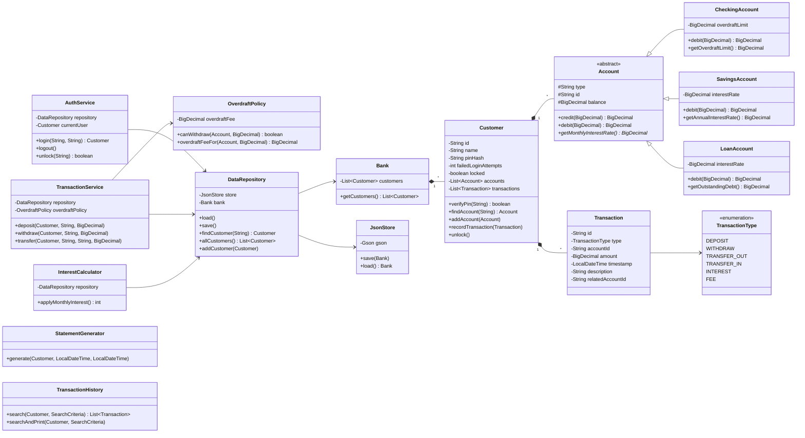

# Class Diagram

## Reading the diagram

- **Filled diamonds (`*--`)** = composition. The container owns the contents:
  if a `Bank` is destroyed, its `Customer`s go with it.
- **Hollow triangles (`<|--`)** = inheritance. `CheckingAccount` *is an*
  `Account`.
- **Arrows (`-->`)** = uses / has a reference to.
- **Italic methods (e.g., `getMonthlyInterestRate()*`)** = abstract — subclasses
  must implement them.
