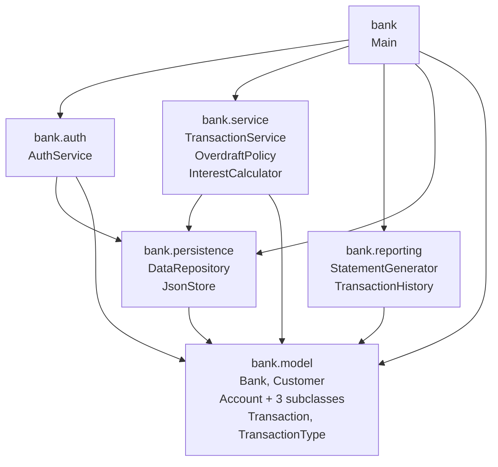

# Package Diagram

How the packages depend on each other. Arrows point from **uses** to
**used by**.

## Why the dependency arrows go this way

- **`model` depends on nothing.** Pure data + behavior. This makes it easy to
  test, easy to serialize, easy to reuse.
- **`persistence` depends only on `model`.** It knows what to save but doesn't
  know who's calling it or why.
- **`service` and `reporting` depend on `model` and `persistence`.** They do
  the actual work; they don't know about UI.
- **`Main` depends on everything.** It's the wiring layer — the only place
  that knows how to assemble the whole app.

This is the standard "onion" layout: the further out a layer is, the more it
knows about the layers below it, but never vice versa.
