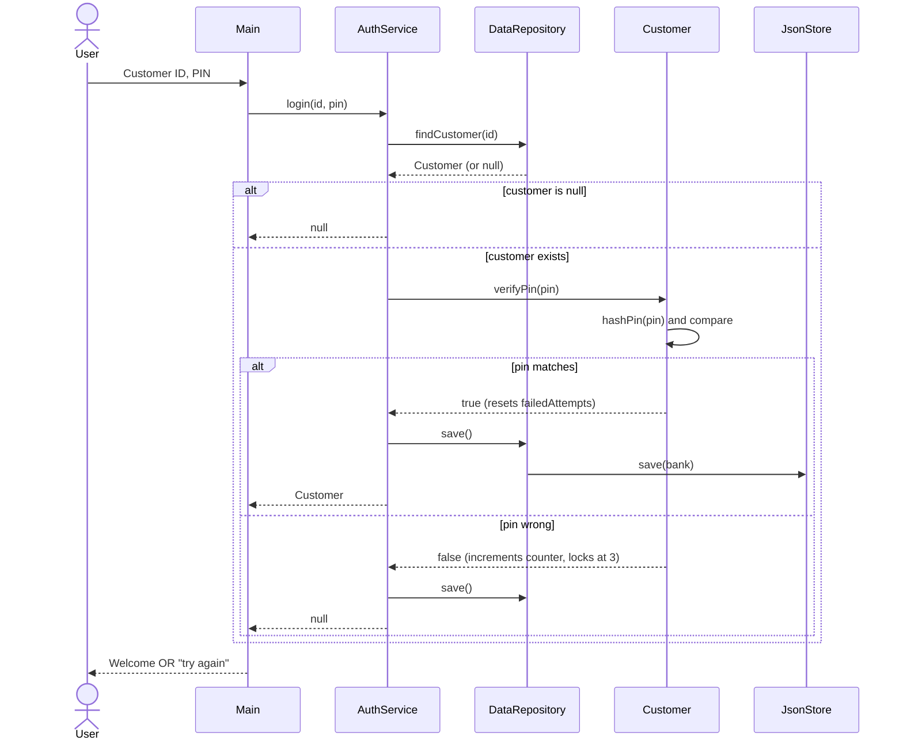

# Sequence Diagram — Login

What happens when a user types their Customer ID and PIN at the prompt.

## Notes

- PINs are stored as SHA-256 hex hashes — the plaintext never touches disk.
- Three wrong PINs in a row sets `locked = true`. Only an admin call to
  `auth.unlock(id)` clears the flag.
- Every state change (failed attempt, lock, successful login) gets persisted
  immediately — closing the program mid-attempt doesn't reset the counter.
