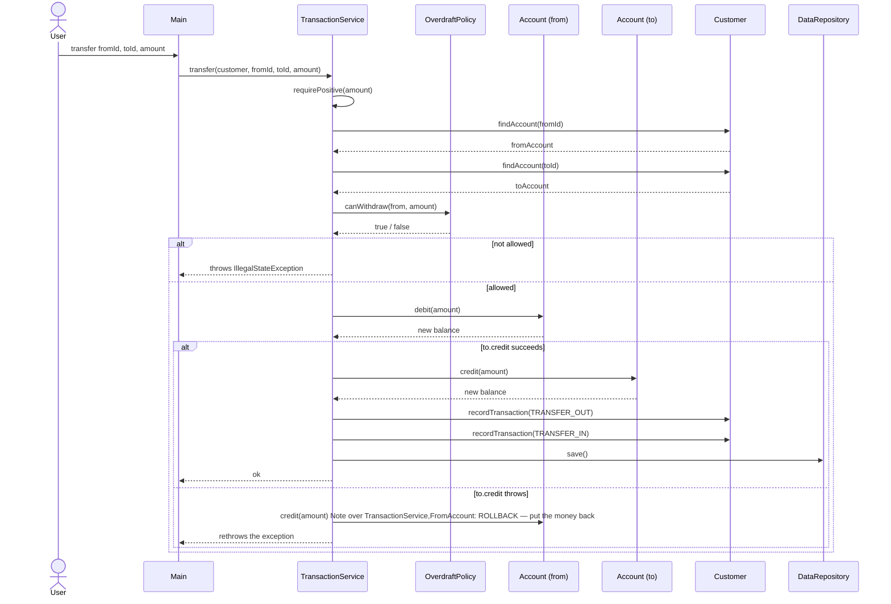

# Sequence Diagram — Transfer (with rollback)

The most interesting flow in the system — moving money between two accounts
atomically. If anything fails after the debit, the money goes back.

## The golden rule

> Either the whole transfer succeeds, or *nothing* changed.

This is why the rollback exists: if step 2 (`to.credit`) ever fails — corrupt
state, a loan account rejecting the credit, anything — the debit on `from` is
reversed before the exception propagates. The customer never loses money on a
half-finished transfer.
